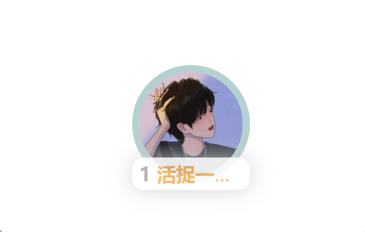
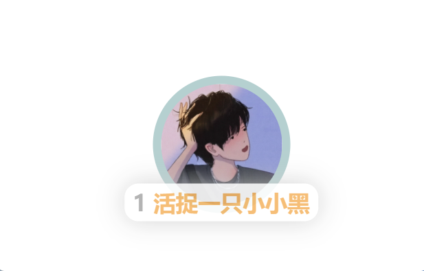

# 带标签的头像 说明文档

## 一.用途

一个带标签的头像vue组件，可用于单独显示排行榜的前几名，

当然封装这个小小的组件过程中用到了很多内容。

## 二.示例

- **初始状态**



- **鼠标覆盖tag状态**



## 三.详细实现过程

### 整体结构

```html
<div class="avatar" :style="{backgroundImage:'url('+imgUrl+')'}">
    <div ref="tag" class="tag" @mouseover="showFullName" @mouseleave="hideFullName">
      <span class="ranking">{{ placing }}</span>
      <span class="name">{{ name }}</span>
    </div>
</div>
```

### 头像框

1. 给父元素定位脱离标准流，这样子元素才能参考
2. 图片采用背景方式填充于div中

```css
.avatar {
  display: inline-block;// 将其转化为行内块元素
  position: relative;	// 为给子元素的标签提供父元素定位参照
  width: 70px;	// 圆框宽度
  height: 70px;	// 圆框高度
  background-size: cover;	// 设置背景样式覆盖
  background-repeat: no-repeat;	// 不重复
  background-position: center;	// 背景居中
  border-radius: 50%;	// 圆角
  border: 5px solid #B5D0D0;	// 边框样式	
}
```

### 动态设置背景

根据传过来的url动态设置背景

```html
<div class="avatar" :style="{backgroundImage:'url('+imgUrl+')'}">
```

### 标签

1. 定位：模式为子绝父相
2. 标签水平居中：通过left50%+transform自身的一半实现，其中自身的一半通过js来计算
3. 字体居中：通过设置行高
4. 省略超出部分：通过设置最大宽度和设置文字溢出属性以及是否换行等来实现是否显示全部，配合js实现鼠标经过显示全部的动画效果

```css
.tag {
  position: absolute;	// 子绝父相
  left: 50%;			//为实现居中
  bottom: -10px;		// 标签相对底部下移10px
  height: 25px;			// 高度
  line-height: 25px;	// 行高等于高度实现居中
  min-width: 20px;		// 最小宽度
  max-width: 70px;		// 最大宽度
  padding: 0 5px;		// 文字距离两边的距离
  text-align: center;	// 文字水平居中
  text-overflow: ellipsis;	// 省略号
  white-space: nowrap;		// 不换行
  overflow: hidden;			// 溢出部分隐藏
  color: #F5B767;			// 字体颜色
  border-radius: 8px;		// 标签圆角
  background-color: #ffffff;	// 背景颜色为白色
  box-shadow: 0 0 15px #cdcdcd;	// 标签的阴影
  opacity: 0.9;					// 标签透明度
}
```

### 动画效果实现（重点）

1. 居中函数

   ```js
   changeWidth(tag) {
       //判断是否要展开，展开需要将maxWidth清空，这样就不会超出范围
         if (this.sign === false)
           tag.style.maxWidth = 'none'
         else {
           tag.style.maxWidth = '70px'
         }
       //利用dom元素的clientWidth属性
         let width = tag.clientWidth
         //向左移动自身的一半
         tag.style.transform = 'translateX(-' + width / 2 + 'px)'
       }
   ```

2. 类似防抖的效果

   - 若鼠标只是一瞬间经过，则不应该展开标签。

   - 因此要设置一个timer，每次利用定时器延时展开。当鼠标在规定的时间内离开时，则应该在离开标签的时候清空timer阻止展开函数的执行。

   - 同理鼠标不小心移开标签，可能是误操作，这是在移到标签上时中间应该不会发生变化。所以也应该和上一步操作一样。

   ```js
   showFullName(e) {
     	// 这里用e.currentTarget而不是直接通过dom获取
       // 具体原因之后说
       let tag = e.currentTarget
       if (this.timer) clearTimeout(this.timer)
       if (this.sign === true) {
           this.timer = setTimeout(() => {
               //设置一个动画渐变效果
               tag.style.transition = '0.5s linear'
               this.sign = false
               this.changeWidth(tag)
           }, 100)
       }
   },
   hideFullName(e) {
       let tag = e.currentTarget
       if (this.timer) clearTimeout(this.timer)
       if (this.sign === false) {
           this.timer = setTimeout(() => {
               this.sign = true
               this.changeWidth(tag)
           }, 100)
       }
   },
   ```

   上述事件只是在鼠标改变时才能触发，但一开始也需要调用changeWidth函数使其居中

### 初始居中方法

在vue组件中可以在mounted钩子函数中调用方法，实现初始居中

```js
mounted() {
    //下面会解释参数
    this.changeWidth(this.$refs.tag)
},
```

而在普通html中有一个window.onload的方法类似vue的mounted钩子函数

```js
let tag = document.querySelector('.tag')
window.onload = function () {
    let avatar = document.querySelector('.avatar')
    avatar.style.backgroundImage = 'url("avatar.jpg")'
    changeWidth(tag)
}
```

### 获取标签元素（难点）

这看似不是什么难题，但没想到给后边使用组件时挖了个大坑

同时使用两次组件出现了以下的情况：


第二个组件图片不仅没对齐，甚至获取不到图片，而且在鼠标覆盖第二个组件的标签时，却只使第一个组件动了

这是因为之前是是通过dom操作获取元素的，而虽然是两个组件，但他们获取dom是都是获取整个页面中的，因此他们获取到的都是第一个，所以两个组件的方法其实都是在对第一个组件操作。

**解决方案**

在函数内部使用e.currentTarget来获取元素

但是在mounted函数中不能触发事件更没有currentTarget可用，因此我只能使用this.$refs来获取元素

```html
<div ref="tag" class="tag" @mouseover="showFullName" @mouseleave="hideFullName">
```

```js
mounted() {
    this.changeWidth(this.$refs.tag)
},
```

### 组件接收参数

自定义属性

```js
props: ['placing', 'name', 'imgUrl']
```

## 四.使用组件

```vue
<template>
<div>
    // 自定义参数传参
	<Avatar :placing="Info.placing" :name="Info.name" :imgUrl="Info.imgUrl"></Avatar> 
</div>
</template>

<script>	
//引入组件
import Avatar from "@/components/planet/Avatar"
export default {
  name: "DetailView",
  components:{
    //注册组件
    Avatar
  },
  data() {
    return {
   	  Info:{
        placing:1,
        name:"活捉一直小小黑",
        imgUrl:"http:../..."
      }
    }
  }
</script>
```

